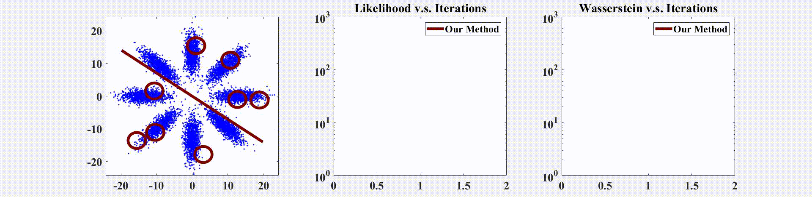

## Solving EMMs via Manifold Optimisation on an Approximate Wasserstein Distance
The code provided in this repo is related to the paper accepted at AAAI2020 (oral), which addresses a general problem of solving elliptical mixture models. This paper proposes an approximate Wasserstein distance to establish explicit statistical manifold for EMMs, followed by an advanced directional Adam algorithm to accelerate and stabilise convergence. Please refer to the paper for more details.

    

## Terms of use
The code is provided for research purposes only and without any warranty. Any commercial use is prohibited.
 
When using the code in your research work, you should cite the following paper:
 
Li, Shengxu, Yu, Zeyang, Xiang, Mmin, & Mandic, Danilo (2019). A general solver to the elliptical mixture model through an approximate Wasserstein manifold. arXiv preprint arXiv:1906.03700.

